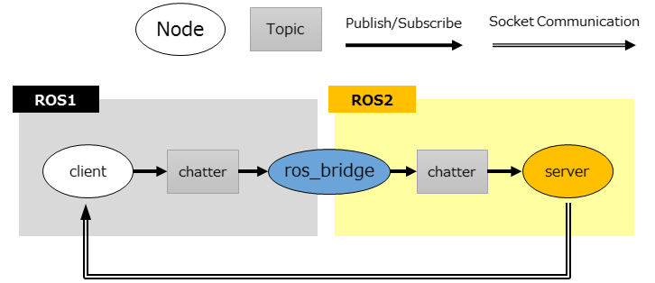

# ros2_evaluation

## 
In **remote** cases, to avoid time synchronization issues, the experiment adopts simple socket communication that routes through neither ROS1 nor ROS2.
*Machine1* transmits data through ROS1 or ROS2, and receives short data through socket communication.
In the adopted method, evaluation halts when *messages* do not reach a *subscriber-node* in the cases with, for example, the  **best-effort policy**, because a *publisher-node* must wait until a *subscriber-node* replies during each publish event.
We estimate end-to-end latencies by subtracting preliminarily evaluated socket communication time.
Using socket communication, the communication latencies between ROS1 and ROS2 can be evaluated respectively. 
However, dividing round-trip latency in half cannot evaluate them and does not be used for this evaluation.v
Figure shows the *node*-graph for evaluation of communication from ROS1 to ROS2 with socket communication and a **ros_bridge** in **remote** cases.

